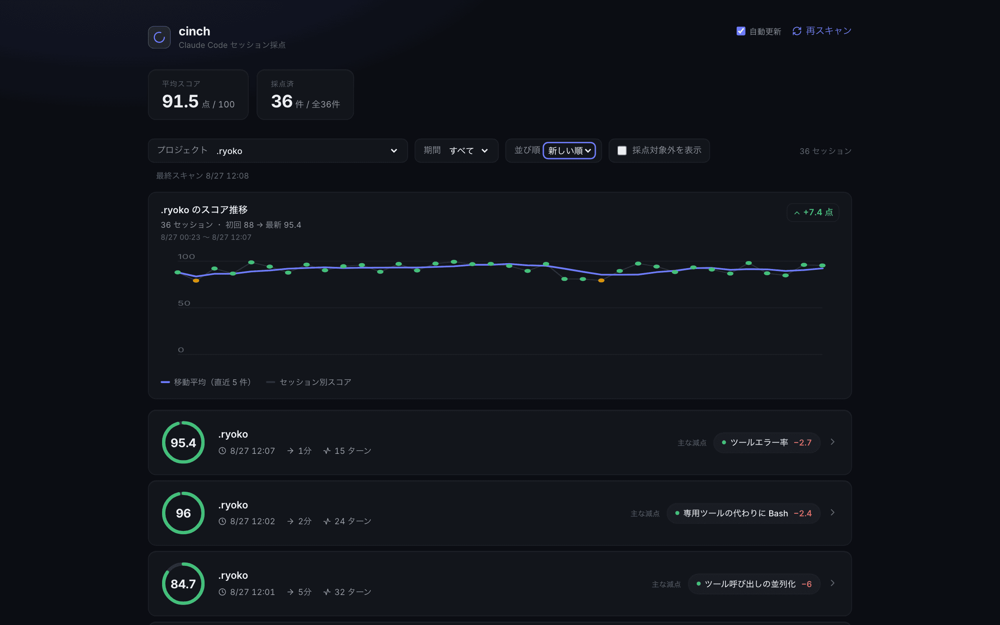
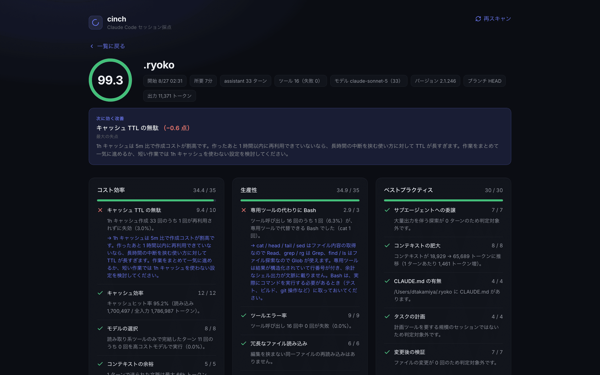

# cinch

ローカルの Claude Code セッションログを解析し、セッション単位で「使い方」を採点する Web アプリ。
減点理由と改善アクションを提示して、自己改善のフィードバックループとして使う。

## スクリーンショット

### セッション一覧

プロジェクト・期間・並び順で絞り込み、スコアと主な減点（失点量を `−N` で併記）を一覧で俯瞰する。プロジェクトを選ぶと、同一プロジェクトのスコア推移（移動平均線・初回→最新の基準明示）も表示される。



### セッション詳細

最大の失点を「次に効く改善」ブロックとしてスコア直下に昇格し、続けて 3 カテゴリごとにルール単位のスコアと、減点理由（事実）・改善アクションを表示する。



## 使い方

```bash
npm install
npm start
```

`http://localhost:5173` を開く。

## 動作の前提

- `~/.claude/projects/<エスケープされた cwd>/<sessionId>.jsonl` を読む。
- **読み取り専用。** ログへの書き込みは一切行わない。
- API サーバは `127.0.0.1:5174` にのみバインドする。セッションログには会話内容が
  含まれるため、外部からアクセスできる場所で待ち受けない。
- API 応答に会話の本文は含めない。数値・ツール名・モデル名のみを返す。
- LLM 呼び出しは行わない。判定は構造的な指標のみで、オフラインで完結する。
- 更新はバッチ読み取り。サーバ側はファイルを監視しない。一覧表示中は
  フロントが 30 秒間隔で `/api/sessions` を静かに再取得して反映する
  （タブが非表示の間は停止。ヘッダの「自動更新」で切り替え可能）。
  手動の「再スキャン」ボタンも従来どおり使える。

## スコアリング

3 カテゴリ、計 15 ルール、100 点満点。assistant ターンが 3 回未満のセッションは
採点対象外（一覧には出るがスコアは付かない）。

| カテゴリ | 配点 | ルール |
|---------|------|-------|
| コスト効率 | 35 | `cache-efficiency`(12) / `cache-ttl-waste`(10) / `model-fit`(8) / `context-window-headroom`(5) |
| 生産性 | 35 | `tool-error-rate`(9) / `redundant-file-reads`(6) / `parallel-tool-use`(6) / `turn-efficiency`(7) / `oversized-tool-results`(4) / `bash-over-native-tools`(3) |
| ベストプラクティス | 30 | `subagent-delegation`(7) / `context-growth`(8) / `claude-md-present`(4) / `task-planning`(4) / `verification-gap`(7) |

閾値はすべて `server/config/thresholds.ts` にある。実データを見て調整する前提の
初期値なので、感覚と合わなければここだけを触る（ルールのテストは壊れない）。

### 判定精度の制約

`parallel-tool-use` と `subagent-delegation` は、「そうすべきだった場面」を構造情報
だけでは確定できない。逐次実行されたツール呼び出しが本当に独立していたのかは
ログから判別できないため、**明らかに独立と分かるケース（読み取り専用ツールのみの
ターン）に限定して判定し、判定できないケースは減点しない**。誤検知で減点するより
検出漏れを許容するほうが、フィードバックツールとして信頼できるため。

この方針の結果として、次のような検出漏れがある（いずれも意図的なもの）:

- **`parallel-tool-use` はターンをまたいだ並列化機会を拾わない。** 判定するのは
  「1 ターンで読み取り専用ツールを 1 件だけ呼んだ」ケースだけで、ターン A で Read、
  ターン B で Read のように分かれた場合は機会として数えない。連続する読み取りターンを
  結合すべきだったかはログからは断定できないため。
- **`cache-ttl-waste` の失効判定は推定。** 1h キャッシュの作成イベントと後続の
  `cache_read` を突き合わせるが、どの読み取りがどの作成分を回収したかの ID 対応は
  ログに無い。「1h 作成後、1 時間以内に `cache_read > 0` のターンがあれば回収された」
  という近似で数えている。TTL ちょうど付近のタイミングや、複数の 1h 作成が
  並行するケースでは実際とずれることがある。

## ルールを追加する

1. `server/rules/<name>.ts` に `Rule` を実装する（純粋関数）。
2. `server/config/thresholds.ts` の `WEIGHTS` に配点を足す。合計 100 を保つこと。
3. `server/rules/index.ts` の `ALL_RULES` に登録する。
4. `src/format.ts` の `RULE_LABELS` に日本語名を足す。

`evidence`（事実）と `advice`（改善案）はルール自身が持つ。「なぜ減点か」「どう直すか」
の説明責任をルールと同じ場所にまとめるため。

## 設計

データの流れは一方向。

```
discover.ts  →  parse.ts  →  metrics.ts  →  rules/*.ts  →  score.ts  →  api.ts
（fs に触る    （JSONL の     （数え上げ。    （1 ファイル   （重み付け   （2 つの
  唯一の層）    知識を閉じ     判断はしない）  1 ルール）     と合算）     endpoint）
                込める）
```

`metrics.ts` 以降はすべて純粋関数なので、ファイルシステムのモックなしでテストできる。
「ツールエラーが 3 件」は事実で `metrics.ts`、「3 件は多い」は判断で `rules/`。
この境界のおかげで、閾値を変えても `metrics.ts` のテストは壊れない。

## 開発

```bash
npm test          # Vitest
npm run typecheck # tsc --noEmit（フロント・サーバ両方）
npm run build     # 型チェック + Vite ビルド
npm run test:e2e  # Playwright（実ブラウザでの描画確認）
```

## E2E（Playwright）

`npm test`（Vitest / jsdom）は実描画しないため、CSS ブロックが丸ごと無効化される
たぐいの事故（例: cinch-020）を素通りさせる。それを実ブラウザ（chromium）で
捕まえるのが `e2e/` の smoke。

```bash
npx playwright install --with-deps chromium  # 初回のみ
npm run test:e2e                             # = playwright test
npx playwright test --list                   # 収集対象の確認（smoke だけが出る）
```

- `playwright.config.ts` の `webServer` が `npm run start:e2e` で api + vite を
  E2E 専用ポート（web 5273 / api 5274）に起動する。開発用の `npm start`
  （5173 / 5174）と衝突しない。
- `e2e/fixtures/seed.ts` が採点済みセッションの JSONL を `e2e/.tmp-sessions/`
  （gitignore 済み）に書き出し、api サーバへ `CINCH_ROOT` で読ませる。実データ
  （`~/.claude/projects`）には依存しない。
- 検証は 2 層。**computed style / DOM / SVG 属性のアサーション**が崩れ検知の
  本体で、これは OS 非依存。加えて `toHaveScreenshot()` の**ビジュアル
  リグレッション**を薄く重ねている（ビューポート固定 1280×720、`fullPage`
  なし）。

### スクリーンショットのベースライン

`toHaveScreenshot()` のベースラインは OS 依存で、Playwright は
`e2e/__screenshots__/smoke.spec.ts-snapshots/<name>-chromium-<platform>.png` を
探す。リポジトリには開発機の `-darwin` が入っている。**CI（Linux）で初めて
走らせると `-linux` が無く、スクショ比較のテストだけが落ちる**（computed style
系のアサーションは通る）。

Linux ベースラインを作ってコミットする:

```bash
docker run --rm -it -v "$PWD":/work -w /work \
  mcr.microsoft.com/playwright:v1.62.1 \
  bash -lc "npm ci && npx playwright test --update-snapshots"
git add e2e/__screenshots__/smoke.spec.ts-snapshots/*-chromium-linux.png
```

ローカル（macOS）でレイアウトを変えたときは `npx playwright test
--update-snapshots` で `-darwin` を撮り直し、Linux 分は上記 docker で
別途更新する。

## スコープ外（後から追加できる形にはしてある）

- サーバ側のファイル監視（SSE / WebSocket 配信）。現状は一覧表示中の
  フロントからの定期ポーリングで代替している
- LLM による会話内容の定性評価
- テキスト内容の正規表現マッチによる手戻り検出
- グラフによる可視化（スコアの時系列推移）
- プロジェクト単位・期間横断の集約スコア
